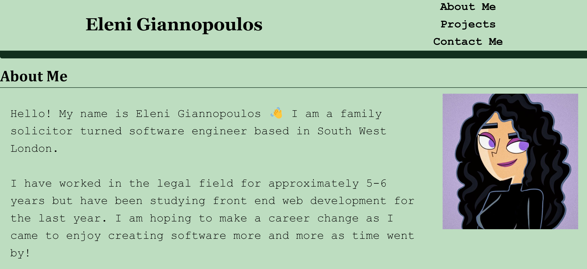
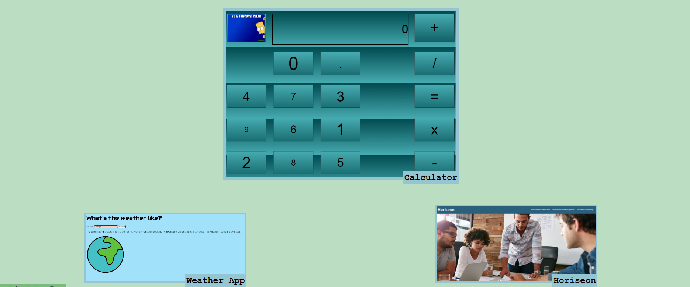
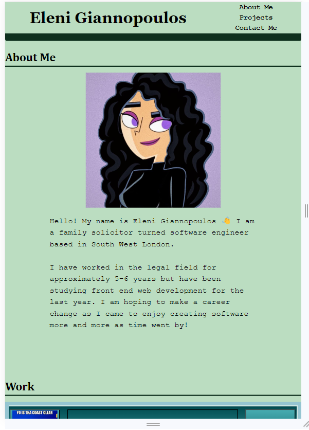
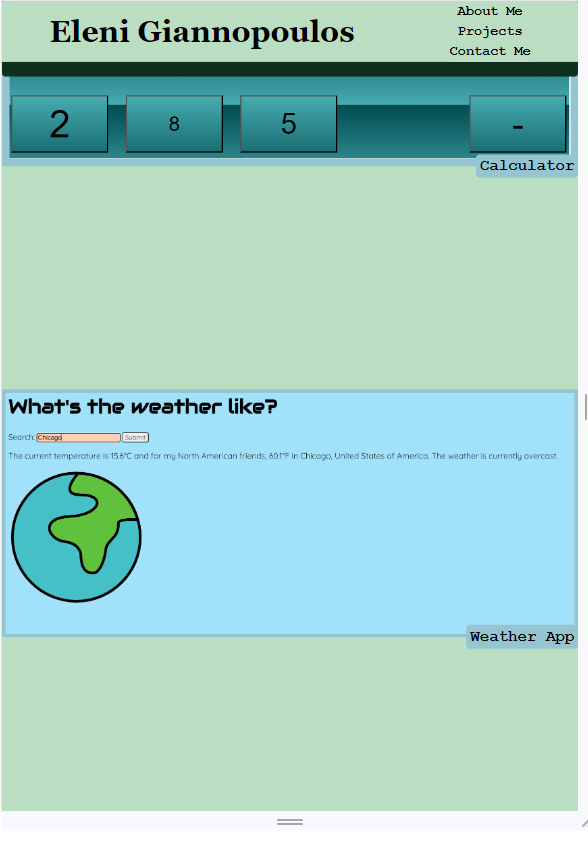

# Portfolio

## Description

My aim with this project was to create a webpage to inform users of information about me, to display my software development portfolio and to provide contact information about myself. This will help for people to easily and quickly view the projects that I am keen to show, rather than going through my personal GitHub account and deciding what to view.

This portfolio project taught me how to display items in a grid format using CSS, and changing arrangements using CSS Flexbox. I have also learned and practised making webpages responsive, and taking into account which elements would need to be changed.

## Installation

N/A

## Usage

Visit the [Portfolio](https://elenimg.github.io/Portfolio/) webpage.

Click any of the links in the navigation bar at the top to go to any of the corresponding sections in the webpage. 

You can click any of the images or headers in the 'Work' section to open any of the deployed applications displayed.

You can also click any of the links in the 'Contact Me' section to send an email, view my GitHub or view my LinkedIn pages.

The Portfolio webpage is responsive, and so will adjust according to your screen size. Please see the following screenshots as an example:

## Credits

The following third-party assets were used to assist with this code:

[Grid Gaps - MDN](https://developer.mozilla.org/en-US/docs/Web/CSS/gap)

[Z-index - MDN](https://developer.mozilla.org/en-US/docs/Web/CSS/z-index)

[CSS Variables - W3 Schools](https://www.w3schools.com/css/css3_variables.asp#:~:text=To%20create%20a%20variable%20with,use%20the%20var()%20function.)

[How to create a sticky header - W3 Schools](https://www.w3schools.com/howto/howto_js_sticky_header.asp)

[Guide to CSS Flexbox - CSS-Tricks](https://css-tricks.com/snippets/css/a-guide-to-flexbox/)